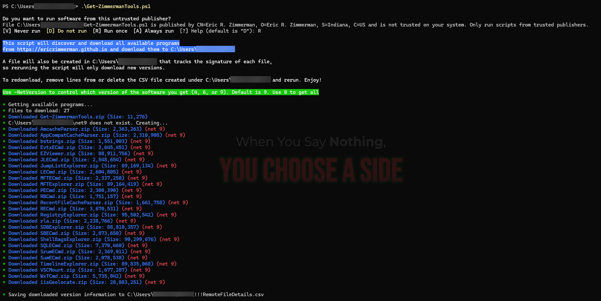

# Guide to Download EricZimmerman's Forensics Tools

EricZimmerman's forensics tools are a comprehensive collection of digital forensics utilities widely used by forensic analysts and investigators. This guide will walk you through the process of downloading and setting up these essential tools.

>💡 **Note:** If you encounter any issues during installation, please refer to the [Requirements and Troubleshooting](#requirements-and-troubleshooting) section at the end of this guide.

## Prerequisites

- Windows operating system (10/11)
- PowerShell (available by default on Windows)
- Internet connection
- Archive extraction software (WinRAR or 7-Zip)
- Administrator privileges (only for final installation step)

## Step 1: Download the Script Package

1. Open PowerShell as a regular user
2. Navigate to your Downloads folder:
   ```powershell
   cd $env:USERPROFILE\Downloads
   ```
3. Download the installation script package:
   ```powershell
   Invoke-WebRequest -Uri "https://download.ericzimmermanstools.com/Get-ZimmermanTools.zip" -OutFile "Get-ZimmermanTools.zip"
   ```

## Step 2: Extract the ZIP File

1. Locate the downloaded `Get-ZimmermanTools.zip` file
2. Extract the ZIP file using one of the following methods:

   **Option A: Using PowerShell (Command Line)**
   ```powershell
   Expand-Archive -Path "Get-ZimmermanTools.zip" -DestinationPath "Get-ZimmermanTools"
   ```

   **Option B: Using GUI Applications**
   - **Using WinRAR**: Right-click → Select "Extract to 'Get-ZimmermanTools\'"
   - **Using 7-Zip**: Right-click → Select "Extract to 'Get-ZimmermanTools\'"

3. Keep the extracted `Get-ZimmermanTools` directory in Downloads for now (we'll move it later)

## Step 3: Execute the Installation Script

1. In the same PowerShell window, navigate to the extracted directory:
   ```powershell
   cd Get-ZimmermanTools
   ```

2. Execute the installation script:
   ```powershell
   .\Get-ZimmermanTools.ps1
   ```

## Step 4: Handle Security Prompt

When you run the script, you'll encounter a security prompt:

```
Do you want to run software from this untrusted publisher?
File C:\Get-ZimmermanTools\Get-ZimmermanTools.ps1 is published by CN=Eric R. Zimmerman, O=Eric R. Zimmerman, S=Indiana, C=US and is not trusted on your system. Only run scripts from trusted publishers.
[V] Never run  [D] Do not run  [R] Run once  [A] Always run  [?] Help (default is "D"): 
```

**Select `R` to run once** - this will execute the script for this session only.

## Step 5: Wait for Download and Installation

The script will automatically:
- Download approximately 27 forensics tools
- Extract each tool to the appropriate directory
- Organize tools in a structured folder hierarchy

**Note**: The download time depends on your internet speed and system performance. Be patient as this process may take several minutes to complete.


*Example of prompts and logs during the EricZimmerman tools installation process*

## Step 6: Move Tools to Final Location

After the download and extraction is complete, move the tools to a permanent location:

1. **Option A: Using PowerShell (Requires Administrator)**
   ```powershell
   # Run PowerShell as Administrator for this step
   Move-Item -Path "$env:USERPROFILE\Downloads\Get-ZimmermanTools" -Destination "C:\EricZimmermanTools"
   ```

2. **Option B: Using File Explorer**
   - Open File Explorer and navigate to your Downloads folder
   - Cut the `Get-ZimmermanTools` folder
   - Navigate to `C:\` drive
   - Paste and rename to `EricZimmermanTools` (optional)

## Step 7: Add Tools to System PATH (Optional but Recommended)

By default, the tools are only accessible using their absolute paths. To access them from anywhere in the command line:

1. Open **System Properties** → **Advanced** → **Environment Variables**
2. Under **System Variables**, find and select **Path**, then click **Edit**
3. Click **New** and add the path to your tools directory (e.g., `C:\EricZimmermanTools`)
4. Click **OK** to save changes
5. Restart PowerShell or Command Prompt to apply changes

## Verification

To verify the installation was successful:

1. Navigate to your installation directory
2. You should see multiple subdirectories and executable files
3. Test a tool by running it from PowerShell:
   ```powershell
   .\ToolName\ToolName.exe --help
   ```

### Expected Tools After Installation

- **AmcacheParser** - Parse Amcache.hve files for application execution artifacts
- **AppCompatCacheParser** - Parse Application Compatibility Cache (Shimcache) data
- **bstrings** - Enhanced strings utility for binary analysis and artifact extraction
- **EvtxECmd** - Parse Windows Event Log files (EVTX) for forensic analysis
- **EZViewer** - Multi-purpose file viewer for various forensic artifacts
- **JLECmd** - Parse Jump List files for application usage tracking
- **JumpListExplorer** - GUI tool to analyze Windows Jump Lists interactively
- **LECmd** - Parse Windows LNK (shortcut) files for file access evidence
- **MFTECmd** - Parse Master File Table ($MFT) for file system analysis
- **MFTExplorer** - GUI tool to browse and analyze NTFS Master File Table
- **PECmd** - Parse Windows Prefetch files for application execution evidence
- **RBCmd** - Parse Recycle Bin artifacts for deleted file recovery
- **RecentFileCacheParser** - Parse RecentFileCache.bcf files for recent file access
- **RECmd** - Registry analysis and parsing tool for Windows Registry forensics
- **RegistryExplorer** - Advanced GUI Windows Registry viewer and analyzer
- **rla** - Replay Log Analyzer for transaction log analysis
- **SDBExplorer** - GUI tool for Application Compatibility Database exploration
- **SBECmd** - Parse ShellBags artifacts for folder access history
- **ShellBagsExplorer** - GUI tool to analyze Windows ShellBags artifacts
- **SQLECmd** - Execute SQL queries against various forensic databases
- **SrumECmd** - Parse System Resource Usage Monitor (SRUM) data
- **SumECmd** - Parse User Access Logging (UAL) files
- **TimelineExplorer** - Timeline analysis and visualization tool for forensic timelines
- **VSCMount** - Mount Volume Shadow Copies for forensic examination
- **WxTCmd** - Parse Windows 10/11 Timeline database (ActivitiesCache.db)
- **iisGeolocate** - Geolocate IP addresses from IIS web server logs

> **Note:** Some tool folders contain the main executable along with necessary DLLs, configuration files, and documentation.

## Requirements and Troubleshooting

### System Requirements

**.NET Framework Requirements:**
- **.NET 4 software** requires at least Microsoft .NET 4.6.2 or newer! You will get errors running these without at least 4.6.2. When in doubt, install it!
- **.NET 6 software** requires at least Microsoft .NET 6 or newer! You will get errors running these without at least .NET 6. When in doubt, install it! **NOTE:** Make sure you get the **Desktop** runtime if you plan on running any of the GUI programs
- **.NET 9 software** requires at least Microsoft .NET 9 or newer! You will get errors running these without at least .NET 9. When in doubt, install it! **NOTE:** Make sure you get the **Desktop** runtime if you plan on running any of the GUI programs

### Important Warnings

⚠️ **DO NOT RUN ANYTHING FOUND HERE FROM 'C:\PROGRAM FILES' DIRECTORY** (unless you run them as administrator)!

⚠️ **DO NOT USE WINDOWS TO EXTRACT THINGS.** Use 7-Zip or WinRAR as Windows will block the DLLs!

✅ **All software is digitally signed.** Once you verify the signature as coming from Eric Zimmerman, any anti-virus hits are false positives. When in doubt, download the files directly from the official source!

### Common Issues and Solutions

**Issue: PowerShell Execution Policy Error**
- **Solution**: Run PowerShell as Administrator and execute: `Set-ExecutionPolicy -ExecutionPolicy RemoteSigned -Scope CurrentUser`

**Issue: Script fails to download tools**
- **Solution**: Check your internet connection and ensure you have sufficient disk space
- **Alternative**: Download tools manually from the official website

**Issue: Tools not found in PATH**
- **Solution**: Restart your command prompt/PowerShell session after adding to PATH
- **Alternative**: Use the full path to the executable

**Issue: Permission denied when moving to C: drive**
- **Solution**: Ensure you're running PowerShell as Administrator for the move operation

**Issue: Antivirus blocking downloads**
- **Solution**: Temporarily disable real-time protection or add an exception for the download directory

**Issue: DPI scaling problems with GUI tools**
- **Solution**: Make a shortcut (or directly against the exe), edit the properties, then click Compatibility. Under "Change high DPI settings", check "Override high DPI scaling behavior" at bottom and choose "System", then click OK out of the dialog

**Issue: .NET runtime errors**
- **Solution**: Install the appropriate .NET version (4.6.2, 6, or 9) with Desktop runtime for GUI applications
- **Download**: Visit Microsoft's official .NET download page for the latest versions

## Security Considerations

- Always download tools from the official source
- Verify the digital signature when prompted
- Keep tools updated by re-running the script periodically